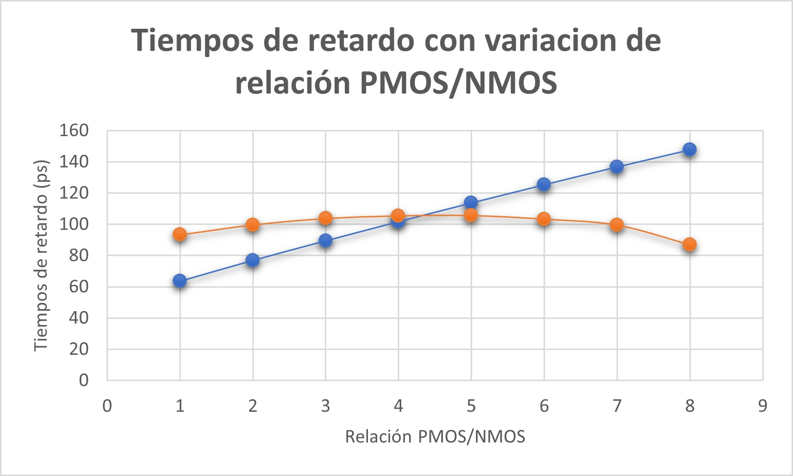

# Informe Tarea 1 VLSI
## Emanuel Cordero Fallas y Yerlyn Mora Artavia
## Introducción

## Parte 1. Determinación de las resistencias de canal de transistores mínimos NMOS y PMOS para el proceso XH018. Módulo LPMOS: ne, pe (1,8V).
### Cálculo teórico de resistencias efectivas
Para el cálculo de las resistencias efectivas se utilizó el método descrito en en el apartado "4.3.7 Determining Effective Resistance" del libro haciendo uso de los datos de la tecnología del curso. Primeramente se utilizó la ecuación 4.16, de lo cual se obtuvo:
Eq. 4.16: $$R{step}=\frac{3\ln{2}}{4}\frac{V_{DD}}{I_{dsat}}\approx \frac{V_{DD}}{2I_{dsat}}$$
* NMOS: $$R_{step_n}=\frac{1.8V}{2 \cdot 475 \mu A/ \mu m}=1894,74 \Omega/ \mu m$$
* PMOS: $$R_{step_p}=\frac{1.8V}{2 \cdot 170 \mu A/ \mu m}=5294,12 \Omega/ \mu m$$

Luego se volvió a calcular las resistencias, pero utilizando la ecuación 4.19:
Eq. 4.19: $$R=\frac{V_{DD}}{I_H+I_L}$$
* NMOS $$R_n=\frac{1.8V}{ 475 \mu A/ \mu m+ 3pA/ \mu m}=3789,47 \Omega/ \mu m$$
* PMOS $$R_p=\frac{1.8V}{ 170 \mu A/ \mu m+ 3pA/ \mu m}=10588,24 \Omega/ \mu m$$

Se observó que los resultados varían bastante, esto se debe a que en la ecuación 4.16 se asume que el transistor conduce una corriente constante incluso con entradas cercanas a $V_{DD}/2$ mientras que en la 4.19 no se asume esto, por lo que se debe utilizar un promedio entre la corriente de encendido y apagado de los transistores.

### Cálculo teórico de capacitancia equivalente de compuerta

## Parte 2. Diseño de un inversor mínimo de tamaño óptimo
### Diseño de un inversor

### Pruebas FO4
* Suponiendo una relación PMOS/NMOS de 2/1, se montó el deck de SPICE equivalente de las figuras 8.9-8.10 del libro del curso, dicho archivo se encuentra en el repositorio con el nombre de "fo4.txt" y con ello se fue variando la relación PMOS/NMOS con tal de ir calculando los retardos de subida y bajada para averiguar cual relación de tamaño lograba que ambos tiempos fueran lo mas similares posibles:


De dicha gráfica se observó que los tiempos más similares se obtuvieron para una relación cercana a 4/1.
* c

### Cálculo de resistencias con simulación 


### Para una fórmula en *markdown*
$$f\left(k\right) = \binom{n}{k} p^k\left(1-p\right)^{n-k}$$ 
## Datos Relevantes
### Para generar listas
* Punto 1
* Punto 2
* Punto 3
## Solución
### Para insertar código
```python
import time
while True
  print("This is a python code")
  time.sleep(5)
```
## Resultados
### Para insertar una tabla 

|  Info1  |  Info2  |  Info3  |  Info4  |
|  :---  |  ---:  |  :---:  |  ---  |
|  A  |  B  |  C  |  D  |
|  AA  |  BB  |  CC  |  DD  |

## Análisis
### Incluir figuras 

