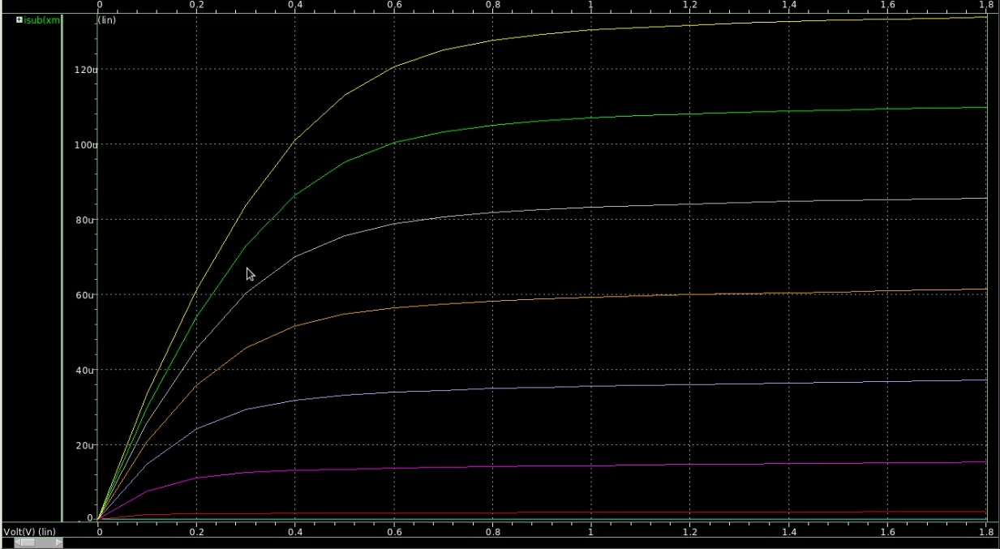
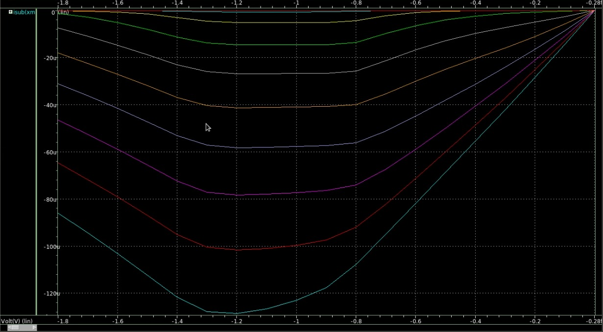
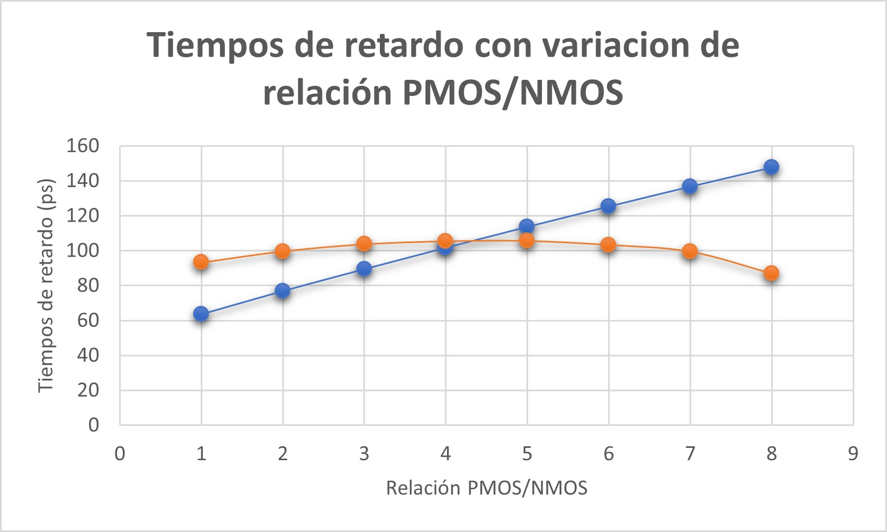
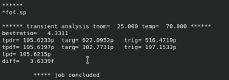

# Informe Tarea 1 VLSI
## Emanuel Cordero Fallas y Yerlyn Mora Artavia
## Introducción

## Parte 1. Determinación de las resistencias de canal de transistores mínimos NMOS y PMOS para el proceso XH018. Módulo LPMOS: ne, pe (1,8V).
### Cálculo teórico de resistencias efectivas
Para el cálculo de las resistencias efectivas se utilizó el método descrito en en el apartado "4.3.7 Determining Effective Resistance" del libro haciendo uso de los datos de la tecnología del curso. Primeramente se utilizó la ecuación 4.16, de lo cual se obtuvo:
Eq. 4.16: $$R{step}=\frac{3\ln{2}}{4}\frac{V_{DD}}{I_{dsat}}\approx \frac{V_{DD}}{2I_{dsat}}$$
* NMOS: $$R_{step_n}=\frac{1.8V}{2 \cdot 475 \mu A/ \mu m}=1894,74 \Omega/ \mu m$$
* PMOS: $$R_{step_p}=\frac{1.8V}{2 \cdot 170 \mu A/ \mu m}=5294,12 \Omega/ \mu m$$

Luego se volvió a calcular las resistencias, pero utilizando la ecuación 4.19:
Eq. 4.19: $$R=\frac{V_{DD}}{I_H+I_L}$$
* NMOS $$R_n=\frac{1.8V}{ 475 \mu A/ \mu m+ 3pA/ \mu m}=3789,47 \Omega/ \mu m$$
* PMOS $$R_p=\frac{1.8V}{ 170 \mu A/ \mu m+ 3pA/ \mu m}=10588,24 \Omega/ \mu m$$

Se observó que los resultados varían bastante, esto se debe a que en la ecuación 4.16 se asume que el transistor conduce una corriente constante incluso con entradas cercanas a $V_{DD}/2$ mientras que en la 4.19 no se asume esto, por lo que se debe utilizar un promedio entre la corriente de encendido y apagado de los transistores.

### Cálculo teórico de capacitancia equivalente de compuerta
Para el cálculo de la capacitancia equivalente de compuerta, se realizaron los cálculos individuales de las capacitancias gate-source, gate-drain y de difusión. Todas las ecuaciones utilizadas, se obtuvieron del documento. 
#### Capacitancia gate-source
$$C_{gs} = W_{dib} \cdot L_{dib} \cdot C_{ox} + W_{dib} \cdot C_{OV}$$
* NMOS $$C_{gs} = 0.22 \mu m \cdot 0.18 \mu m \cdot 8.46 \frac{fF}{\mu m^2} + 0.22 \mu m \cdot 0.33 \frac{fF}{\mu m^2} = 0.4076 fF$$
* PMOS $$C_{gs} = 0.22 \mu m \cdot 0.18 \mu m \cdot 8.91 \frac{fF}{\mu m^2} + 0.22 \mu m \cdot 0.32 \frac{fF}{\mu m^2} = 0.4232 fF$$

#### Capacitancia gate-drain
$$C_{gd} = W_{eff} \cdot C_{OV}$$
* NMOS $$C_{gd} = 0.17 \mu m \cdot 0.33 \frac{fF}{\mu m} = 0.0561 fF$$
* PMOS $$C_{gd} = 0.25 \mu m \cdot 0.32 \frac{fF}{\mu m} = 0.08 fF$$

#### Capacitancia de difusión 
$$C_{db} = C_{sb} = C_{gs}$$
* NMOS $$C_{db} = C_{sb} = 0.4076 fF$$
* PMOS $$C_{db} = C_{sb} = 0.4232 fF$$

Finalmente, la capacitancia equivalente del NMOS y el PMOS, se calculó a partir de la siguiente ecuación:
$$C_{g} = C_{gs} + C_{gd}$$
* NMOS $$C_{g} =  0.4076 fF + 0.0561 fF = 0.4637 fF$$
* PMOS $$C_{g} = 0.4232 fF + 0.08 fF = 0.5032 fF$$

## Parte 2. Diseño de un inversor mínimo de tamaño óptimo
### Diseño de un inversor
En cuanto al diseño de un inversor, se establecieron los siguientes valores para cada uno de los transistores:
* NMOS $$W=2u$$ $$L=0.8$$
* PMOS $$W=4u$$ $$L=0.8$$
Para la confirmación del diseño, se graficaron las curvas características de ambos transistoreS. A continuación se muestra la curva característica del NMOS. 


A continuación se muestra la obtenida para el transistor PMOS. 


### Pruebas FO4
* Suponiendo una relación PMOS/NMOS de 2/1, se montó el deck de SPICE equivalente de las figuras 8.9-8.10 del libro del curso, dicho archivo se encuentra en el repositorio con el nombre de "fo4.txt" y con ello se fue variando la relación PMOS/NMOS con tal de ir calculando los retardos de subida y bajada para averiguar cual relación de tamaño lograba que ambos tiempos fueran lo mas similares posibles:


De dicha gráfica se observó que los tiempos más similares se obtuvieron para una relación cercana a 4/1.
* Seguidamente se probó optimizar el fo4 con el código que se proporciona en la figura 8.11 del libro, esto para comprobar la relación PMOS/NMOS obtenida en el punto anterior. De dicha optimización el programa indicó que la relación de tamaños más adecuada para igualar los tiempos debe ser de 4.33/1.


Con estos datos se corrobora que la relación de tamaños debe ser muy cercana a 4/1, sin embargo a la hora de fabricar la compuerta se debe tener en cuenta qué tan precisa necesito que sea, ya que entre las 2 relaciones obtenidas se obtienen tiempos muy parecidos por lo que ahorrar un poco de área en los transistores va a requerir menos potencia de operación y si la aplicación no es muy crítica esto puede resultar beneficioso. De igual manera se puede ampliar el rango de busqueda para el script de optimización, sin embargo con ayuda de las gráficas se puede esperar que para relaciones de tamaño mayores la diferencia de tiempos siga aumentando.

* Finalmente se procedió a calcular las resistencias de los transistores utilizando las ecuaciones de la sección 8.4.5 del libro, esto se hizo utilizando la relación obtenida por el optimizador y con los valores de capacitancia obtenidos en la primera parte de la tarea.
Los datos de tiempo utilizados se muestran en la siguiente tabla:

|     |  H=3  |  H=4  |  $\Delta t$  |
|  :---  |  ---:  |  :---:  |  ---  |
|  $t_{pdr} (ps)$ |  91,1573  |  105,6255  |  14,4682  |
|  $t_{pdf} (ps)$ |  85,9056  |  105,6065  |  19,7009  |

Una vez obtenidos los valores de tiempo se procede a despejar las resistencias de las siguientes ecuaciones:
$$\Delta t_{pdr}=\frac{3}{2}R_p C$$

En donde $C=0,503fF$, por lo tanto:

$$ R_p= 19,175 k \Omega $$

De la misma manera para el transistor NMOS:
$$\Delta t_{pdf}=\frac3R_n C$$

en donde $C=0,4631fF$, por lo tanto:
$$R_n= 14,180 k \Omega $$

Finalmente las constantes de tiempo resultantes son:

$$\tau_p= 9,65ps$$

y para el NMOS:

$$\tau_n= 6,57ps$$


### Para una fórmula en *markdown*
$$f\left(k\right) = \binom{n}{k} p^k\left(1-p\right)^{n-k}$$
## Datos Relevantes
### Para generar listas
* Punto 1
* Punto 2
* Punto 3
## Solución
### Para insertar código
```python
import time
while True
  print("This is a python code")
  time.sleep(5)
```
## Resultados
### Para insertar una tabla 

|  Info1  |  Info2  |  Info3  |  Info4  |
|  :---  |  ---:  |  :---:  |  ---  |
|  A  |  B  |  C  |  D  |
|  AA  |  BB  |  CC  |  DD  |

## Análisis
### Incluir figuras 

